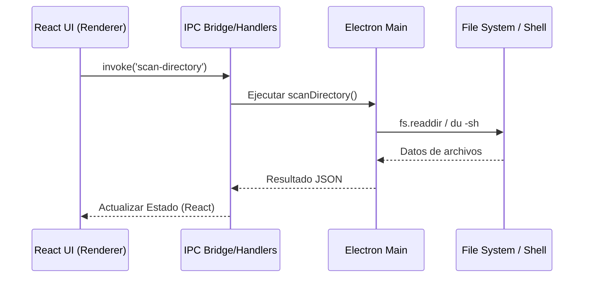

# Documentación Técnica

## Arquitectura del Sistema

McClean sigue una arquitectura de **Proceso Principal (Main Process) + Proceso de Renderizado (Renderer Process)**, típica de aplicaciones Electron.

### Diagrama de Flujo de Datos

### Tecnologías

- **Runtime**: Electron.
- **Framework UI**: React 18.
- **Lenguaje**: TypeScript (Strict mode).
- **Build System**: Vite (para HMR rápido y bundling eficiente).
- **Gestión de Estado**: React `useState` / props drilling (actualmente). Se planea migrar a Context API o Zustand si la complejidad crece.

### Detalles de Implementación

#### Proceso Principal (`electron/main.ts`)

- **Seguridad**: `nodeIntegration: false`, `contextIsolation: true`.
- **IPC**: Uso de `ipcMain.handle` para operaciones asíncronas que devuelven resultados al UI.
- **Escaneo Síncrono/Asíncrono**: Uso de `du` (disk usage) via `exec` para calcular tamaños de carpetas de manera eficiente, ya que la recursión en Node.js puede ser lenta para carpetas profundas como `node_modules`.

#### Proceso de Renderizado (`src/`)

- **Componentes**: Estructura funcional. Cada "página" (Dashboard, Apps, etc.) es un componente.
- **Routing**: Gestión manual de vistas (`activeView` state) para mantener la ligereza, sin react-router por el momento.
- **Estilos**: CSS puro con variables CSS personalizadas para temas.

## Consideraciones de Seguridad

1.  **File System Access**: El acceso al sistema de archivos está restringido estrictamente al proceso principal. El renderizado solo pide acciones, no ejecuta comandos de FS directamente.
2.  **Borrado Seguro**: La función `move-to-trash` utiliza la API nativa del SO (`shell.trashItem`), lo que permite recuperación. No se utiliza `rm -rf` directo a menos que sea una funcionalidad explícita de "Shredder" en el futuro.

## Requisitos de Desarrollo

- Node.js v18+
- npm o yarn
- macOS (para desarrollo de funcionalidades específicas como Homebrew o rutas de sistema típicas de Mac).
